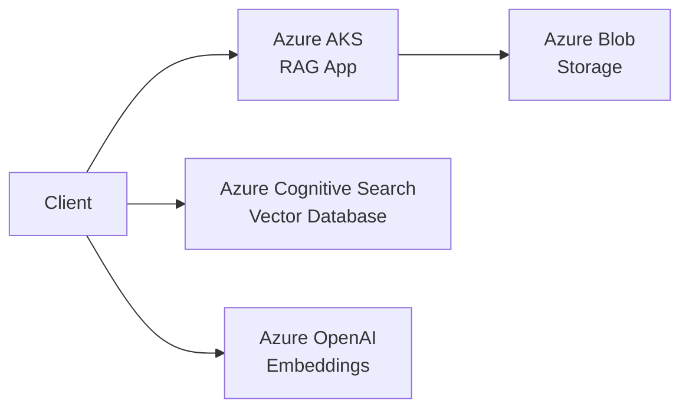

# RAG-App-Azure-Deployment
A production-ready Retrieval-Augmented Generation (RAG) application deployed on Microsoft Azure with Kubernetes orchestration.

## Architecture

## Architecture



## Features

- ✅ Multi-PDF processing and vectorization
- ✅ Semantic search with vector embeddings
- ✅ Kubernetes orchestration with auto-scaling
- ✅ Azure Managed Identity for secure authentication
- ✅ Encryption at rest and in transit
- ✅ Network isolation with private endpoints
- ✅ Comprehensive monitoring and logging
- ✅ High availability with 3+ replicas

## Prerequisites

- Azure subscription
- Azure CLI (`az`)
- Terraform >= 1.0
- kubectl
- Docker
- Helm 3

## Quick Start

### 1. Clone Repository

```bash
git clone https://github.com/crs-infra/RAG-App-Azure-Deployment.git
cd rag-application
